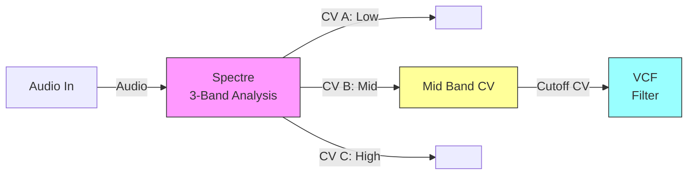
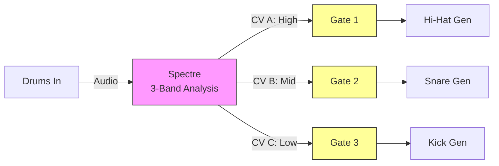

# Spectre - 3-Band Spectral Envelope Follower

<div align="center">


*Real-time FFT analysis with three independent CV envelope outputs*

</div>

## Overview

**Spectre** is a sophisticated spectral envelope follower plugin for the Expert Sleepers Disting NT. It performs real-time FFT analysis on incoming audio and extracts envelope information from three user-configurable frequency bands, outputting CV signals that follow the energy in each band.

### Key Features

- **Real-time FFT Analysis** with 512-point FFT running at 60Hz
- **Three Independent Frequency Bands** with configurable center frequencies
- **Dual Detection Modes**: RMS (power-based) and Peak detection
- **Proportional Bandwidth Control**: Variable from 10% to 200% (default: 1/3 octave)
- **Precise Envelope Following**: Separate attack (1-1000ms) and release (10-5000ms) controls
- **Live Spectrum Display** on OLED with band position markers and pink noise reference
- **CV Envelope Outputs** (0-10V) with accurate voltage scaling
- **Interactive Controls** via pots and encoders

## Visual Interface

### Main Display

The Disting NT has a monochrome OLED display (256×64 pixels) showing:
- **Live spectrum**: Vertical bars representing FFT magnitude at each frequency
- **Pink noise reference**: Background overlay showing ideal 1/f spectrum slope
- **Band markers**: Vertical lines at Band A, B, and C center frequencies
- **Band labels**: Small markers at top indicating which band is which

## User Manual

### Quick Start

1. **Load the plugin** onto your Disting NT
2. **Connect audio input** to the designated input
3. **Connect CV outputs** to your desired destinations
4. **Adjust frequency bands** using the three pots
5. **Fine-tune display** with the encoders

### Control Reference

#### Frequency Band Controls (Pots)

| Control | Function | Range |
|---------|----------|-------|
| **Pot L** | Band A Center Frequency | 20 Hz - 20 kHz |
| **Pot C** | Band B Center Frequency | 20 Hz - 20 kHz |
| **Pot R** | Band C Center Frequency | 20 Hz - 20 kHz |

The frequency mapping follows a **logarithmic scale** for musical perception:
- Fully CCW: 20 Hz (sub-bass)
- 12 o'clock: ~450 Hz (midrange)
- Fully CW: 20 kHz (high frequencies)

#### Display Controls (Encoders)

| Control | Function | Effect |
|---------|----------|--------|
| **Encoder L** | Spectrum Y-Scale | Each detent: ×2 or ×½ scaling |
| **Encoder R** | Detection Mode | Toggles: RMS ↔ Peak |

### Parameter Pages

The plugin has three parameter pages accessible via the standard Disting NT menu:

1. **Routing Page** - Configure I/O routing
2. **Spectral Page** - Set band center frequencies
3. **Envelope Page** - Configure bandwidth, attack/release times, and detection mode

### CV Output Behavior

Each frequency band generates a **0-10V CV signal** that follows the energy in that band:

- **0V**: No energy detected in the band
- **10V**: Maximum energy detected
- **Response**: Configurable attack/release times (default: 10ms attack, 100ms release)
- **Bandwidth**: Proportional to center frequency (default: 1/3 octave)

### Performance Tips

1. **For Percussion**: Use Peak detection mode and fast attack times (1-10ms)
2. **For Sustained Sounds**: Use RMS detection mode with longer attack times (50-200ms)
3. **Band Spacing**: Space frequency bands at least 1 octave apart for independent tracking
4. **Bandwidth Control**: Wider bands capture more energy but lose frequency specificity
5. **Pink Noise Reference**: Use the background overlay to match your mix's spectral balance

## Patching Examples

### Basic Spectrum-Controlled Filter



*Mid-frequency band controls filter cutoff - filter opens when midrange content is present*

### Multi-Band Drum Gate



*Each frequency band triggers a different drum sound generator for multi-band separation*

## Suggested Usage Scenarios

### 1. **Frequency-Responsive Effects**

**Setup**: Route CV outputs to control effect parameters
- **Low band** → Reverb size (more reverb on bass hits)
- **Mid band** → Delay feedback (delay swells with vocal)
- **High band** → Filter resonance (emphasis on cymbals)

**Patch Notes**:
- Set bands to: 80Hz (low), 800Hz (mid), 8kHz (high)
- Attenuate CV signals if effects are too sensitive
- Use RMS mode for smooth control of effect parameters

### 2. **Spectral Gate Sequencing**

**Setup**: Use Spectre to create rhythm from any audio source
- Analyze complex audio (full mixes, field recordings)
- Extract rhythmic patterns from different frequency ranges
- Drive clock dividers or sequencers with the CV outputs

**Patch Notes**:
- Use Peak mode for better transient detection
- Use comparators to convert CV to clean gates
- Adjust attack/release times to shape gate behavior

### 3. **Harmonic Following Bass**

**Setup**: Extract bass notes from polyphonic material
- **Low band** centered around fundamental frequency range
- CV output drives oscillator pitch or filter cutoff
- Creates a bass line that follows the harmonic content

**Patch Notes**:
- Set low band around 60-250Hz for bass fundamentals
- Use envelope follower on CV output for smoother pitch changes
- Combine with sample & hold for stepped bass lines

### 4. **Vocal Formant Analysis**

**Setup**: Track speech characteristics for vocal processing
- **Band A**: 800Hz (first formant)
- **Band B**: 1200Hz (second formant)
- **Band C**: 2500Hz (third formant)

**Applications**:
- Vocoder control signals
- Speech-responsive synthesis
- Automatic vocal EQ following

### 5. **Dynamic Frequency Splitting**

**Setup**: Create frequency-dependent dynamics
- Each band controls a VCA or compressor
- Different frequency ranges get different dynamic treatment
- Useful for mastering and bus processing

**Patch Notes**:
- Set narrow bandwidths (10-20%) for precise frequency isolation
- Invert some CV signals for frequency-dependent expansion
- Use RMS mode for smooth dynamics control

### 6. **Percussive Element Extraction**

**Setup**: Isolate drum elements from complex mixes
- **High band**: Cymbals and hi-hats (8kHz+)
- **Mid band**: Snares and claps (200Hz-2kHz)
- **Low band**: Kick drums (40-100Hz)

**Creative Uses**:
- Trigger samples based on frequency content
- Create drum fills from non-percussive sources
- Extract groove from full mixes

### 7. **Environmental Sound Reactive**

**Setup**: Respond to ambient sound characteristics
- **Low**: Rumble and mechanical sounds
- **Mid**: Voice and melodic content
- **High**: Birds, wind, electronic sounds

**Applications**:
- Generative music systems
- Sound installation control
- Adaptive soundscapes

## Advanced Techniques

### CV Processing Tips

1. **Smoothing**: Add slew limiters to CV outputs for smoother parameter changes
2. **Scaling**: Use attenuverters to scale CV ranges to match your modules
3. **Logic**: Combine CV signals with logic modules for complex behaviors
4. **Quantization**: Quantize CV outputs for musical intervals

### Frequency Band Strategies

- **Musical Intervals**: Set bands to musical ratios (octaves, fifths)
- **Instrument Ranges**: Match bands to specific instrument frequency ranges
- **Psychoacoustic**: Use critical band frequencies for perceptual relevance
- **Dynamic**: Modulate band frequencies for animated analysis

### Performance Considerations

- **FFT Size vs. Latency**: Smaller FFT = lower latency but less frequency precision
- **Band Overlap**: Overlapping bands can create interesting interactions
- **Input Gain**: Adjust input levels for optimal analysis sensitivity
- **Update Rate**: Consider how fast you need the analysis to respond

## Building from Source

### Prerequisites

You need the ARM GCC toolchain installed:

**macOS (Homebrew):**
```bash
brew install --cask gcc-arm-embedded
```

**Linux (Ubuntu/Debian):**
```bash
sudo apt-get install gcc-arm-none-eabi
```

**Windows:**
Download and install the [ARM GNU Toolchain](https://developer.arm.com/downloads/-/arm-gnu-toolchain-downloads).

### Repository Setup

1. **Clone the repository with submodules:**
```bash
git clone --recursive https://github.com/yourusername/spectre.git
cd spectre
```

2. **If you already cloned without `--recursive`, initialize submodules:**
```bash
git submodule update --init --recursive
```

This will download:
- `extern/distingnt-api/` - Disting NT plugin API
- `extern/cmsis-dsp/` - ARM CMSIS-DSP mathematics library

### Build Process

1. **Build the plugin:**
```bash
make
```

2. **Check for undefined symbols:**
```bash
make check
```

3. **View memory usage:**
```bash
make size
```

4. **Clean build artifacts:**
```bash
make clean
```

### Build Output

The build process generates:
- **`build/spectralEnvFollower_plugin.o`** - Final plugin file for Disting NT
- **`build/spectralEnvFollower.o`** - Main plugin object
- **`build/extern/cmsis-dsp/`** - CMSIS-DSP object files

### Installation

1. Copy `build/spectralEnvFollower_plugin.o` to your Disting NT
2. Follow the Disting NT plugin installation procedure
3. The plugin will appear as "SpecEnv 3‑Band" with GUID `ThSf`

## Technical Specifications

### Audio Processing
- **Sample Rate**: Matches Disting NT host (typically 48 kHz)
- **Bit Depth**: 32-bit floating point internal processing
- **FFT Algorithm**: ARM-optimized CMSIS-DSP implementation
- **Windowing**: Hann window for spectral analysis
- **Latency**: Depends on FFT size (256 samples minimum)

### Memory Usage
- **Program Memory**: ~586 KB (including FFT lookup tables)
- **DTC Memory**: ~20.6 KB (audio buffers and FFT workspace)
- **SRAM**: <1 KB (algorithm instance)

### Frequency Response
- **Analysis Range**: 0 Hz to Nyquist frequency (sample_rate/2)
- **Band Width**: ±3 FFT bins around center frequency
- **Frequency Resolution**: sample_rate / FFT_size

## Troubleshooting

### Common Issues

**Q: Plugin doesn't appear in Disting NT**
- Verify the `.o` file is properly copied
- Check that submodules are initialized (`git submodule status`)
- Ensure ARM toolchain is correctly installed

**Q: Build fails with "command not found"**
- Install ARM GCC toolchain
- Add toolchain to your PATH environment variable

**Q: Undefined symbol errors**
- Run `make check` to see which symbols are undefined
- Expected symbols: `NT_*`, `memset`, math functions, ARM EABI functions

**Q: No audio response**
- Verify audio input is connected
- Check that CV outputs are properly routed
- Adjust Y-scale with Encoder L if spectrum is too small

### Development

For development and debugging:
```bash
# View symbol table
arm-none-eabi-nm build/spectralEnvFollower_plugin.o

# Disassemble code
arm-none-eabi-objdump -d build/spectralEnvFollower_plugin.o

# Check dependencies
arm-none-eabi-objdump -p build/spectralEnvFollower_plugin.o
```

## License

This project is released under the MIT License. See the LICENSE file for details.

## Credits

- **Developer**: Thorinside (Neal Sanche)
- **FFT Library**: ARM CMSIS-DSP
- **Platform**: Expert Sleepers Disting NT
- **Generated with assistance from**: Claude Code

## Version History

### v1.0.0 (2025-10-25)
- Initial release
- 3-band spectral envelope follower with 512-point FFT
- RMS and Peak detection modes
- Proportional bandwidth control (10-200%)
- Attack/Release envelope parameters (1-1000ms, 10-5000ms)
- Pink noise reference overlay on spectrum display
- Proper FFT normalization and voltage scaling for accurate CV output
- Fixed envelope timing to use FFT update rate (60Hz)